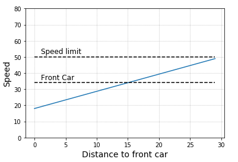

# Writeup for Path Planning Project

In this project I implemented the C++ algorithms for a car to drive safely on a highway simulation with other cars driving a different speeds. My car manages to adapt to the highway traffic, change lanes when safe in order to drive faster, while keeping below the 50 MPH speed limit and within its lane.

The goals for the project are described in the [Project's Rubric](https://review.udacity.com/#!/rubrics/1971/view):

- The code compiles correctly.
- The car is able to drive at least 4.32 miles without incident.
- The car drives according to the speed limit.
- Max Acceleration and Jerk are not exceeded.
- Car does not have collisions.
- The car stays in its lane, except for the time between changing lanes.
- The car is able to change lanes

All the goals were fulfilled in the final implementation of the code.

The main part of the code was implemented in `main.cpp`, while some functions where placed in `helpers.h` to improve readability and modularity to the code.

## main.cpp

The architecture to communicate with the simulator is already given here. The central part of the program begins when the simulator delivers data from line 97: `if (event == "telemetry") {`

After this the data coming from the simulator is stored in several variables and the vectors used to deliver the next path locations to our car are declared:
```
vector<double> next_x_vals;
vector<double> next_y_vals;
```

From here begins my own implementation of the code. The structure of my code can be broken down in:

- **Prediction** of the future position of my car and other cars on the road
- **Behavior Planning** of my car using costs functions to evaluate which lane to use
- **Trajectory Generation** to accelerate, keep in lane speed, and change lanes, keeping low levels of jerk and acceleration

## Prediction

On each cycle the code will feed a series of 50 path points to the simulator for our car to follow. Not all of this positions will be realized at the end of the cycle, and the simulator will feed back  the previous path points that were left over. I want to add path points from the last of the previous path position. This is a position in the future of my car that I calculate and it is from this predicted position that I refer the rest of the operations to decide the future planning and trajectory.

On the first cycle there will be of course no path leftover and the initial position will be taken as the predicted position.

The quantities of interest are the last position on Frenet coordinates, the last and the one before last positions of the previous path in map x, y coordinates. From these last two positions I calculate the car's angle and its velocity. Having these two points will also be necessary to generate the next trajectory using the spline curve.

```
pred_x = previous_path_x[path_size-1];
pred_y = previous_path_y[path_size-1];
pred_x2 = previous_path_x[path_size-2];
pred_y2 = previous_path_y[path_size-2];
pred_phi = atan2(pred_y-pred_y2,pred_x-pred_x2);
double last_dist = sqrt(pow(pred_y-pred_y2,2) + pow(pred_x-pred_x2, 2));
car.pred_vel = last_dist/0.02;
pred_s = end_path_s;
pred_d = end_path_d;
```

Finally I also calculate predicted car lane and a boolean flag that indicates whether the car is currently changing lanes.

```
car.pred_lane = pred_d / 4;
bool changing_lanes = (car.pred_lane != car.goal_lane);
```

The following section of the code refers to predicting the others cars positions when my car is at the predicted point. I will use this information to determine, for each lane, whether there is a car near me, either on the back or at the front, and based on this the maximal speed allowed at each lane.

First I reduce the amount of calculation by storing in the vector `cars_in_lane` only the cars closest than 50 meters on the front or behind. Next I loop over this vector and choose the closest one on the front or behind, and store its distance from my car and velocity in the vectors:

 ```
vector<double> front_car_dist(3, 500);
vector<double> back_car_dist(3, 500);
vector<double> front_car_vel(3, -1);
vector<double> back_car_vel(3, -1);
 ```

Having the distance and speed of the closest car in front of us on each lane, we can determine the maximal speed that our car will be able to drive on each lane. My first attempt was to set this velocity equal to the car in front of me, but this realistic and dynamic enough for some cases I encountered on the simulator. So, I finally set the speed with the following formula: when the next car is 30m in front I began to adapt my speed to it linearly so that I set its same speed when it is 15 meters in front of me. If the distance if further reduced for some reason I continue this linearity down to an even lower speed that the car in front of me has. That way I will expand the buffer back to the 15m safety distance.

This formula can be expressed as a linear function Y = X * A + B, with the indexes A and B properly chosen as shown in the code snippet below.



```
for(int check_lane = 0; check_lane<3; ++check_lane){
  if(front_car_dist[check_lane] < 30){
    double A = (speed_limit - front_car_vel[check_lane]) / 15;
    double B = 2*front_car_vel[check_lane] - speed_limit;
    max_speed[check_lane] = A * front_car_dist[check_lane] + B;
  }
  else{
    max_speed[check_lane] = speed_limit;
  }
}
```

